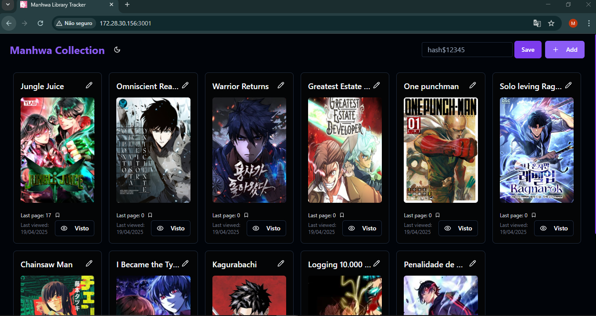

# 📚 Manhwa Library Tracker

A beautifully crafted web application for managing your personal collection of **manhwas**, **mangas**, and **webtoons**. This project allows you to visually track which series you're reading, bookmark your progress, and store all your favorite sources in one place.



---

## ✨ Features

- ⚡ Built with **React + Vite** for lightning-fast performance.
- 🎨 Styled using **MUI (Material UI)** for a clean and responsive interface.
- 🖼️ Display cards for each title with:
  - Editable **title**
  - Editable and extendable list of **source URLs**
  - Editable **image cover (via URL)**
- ➕ Add new entries with a **modal form** (requires at least a title and one URL).
- ✅ **"Check" Button**:
  - Marks a title as recently viewed
  - Updates the `lastViewed` field via a PUT request to the API
  - Sends the card to the **end of the list**
- 🔁 **Infinite scroll** with **paginated requests**
- 🌗 Dark mode ready!

---

## 🧠 Backend Overview

This app relies on a custom-built Node.js (Express) API that handles card data and authentication.

### Available Endpoints:

- `GET /api/v1/card`: Lists paginated cards
- `GET /api/v1/card/:idCard`: Retrieves a single card
- `POST /api/v1/card`: Creates a new card (auth required)
- `PUT /api/v1/card/:idCard`: Updates an existing card (auth required)
- `DELETE /api/v1/card/:idCard`: Deletes a card (auth required)

---

## 🛠️ Tech Stack

### Frontend

- **React (Vite)**
- **MUI**
- **Axios**
- **React Infinite Scroll**
- **TypeScript**

### Backend

- **Node.js + Express**
- **Hash authentication**
- **Postgresql**

---

## 🚀 Deployment

The frontend is deployed and publicly available at:

🔗 [https://my-fav-links.vercel.app](https://my-fav-links.vercel.app)

> The backend is served separately and requires authentication for protected routes.

---

## 📦 Local Development

### Prerequisites

- Node.js
- Postgres
- Vite

### Running Locally

```bash
# Clone the repository
git clone https://github.com/Megas-MDN/my-fav-links.git
cd my-fav-links

# Install dependencies and run
npm install
npm run dev

```

<hr>

###### 💡 Tip:

To access the links from the deployed app, don’t forget to set any hash (ex: 123) in the header input field — just type it and hit save 😉

<hr>
<p align="center">
Developed with ❤️ by Megas
</p>
